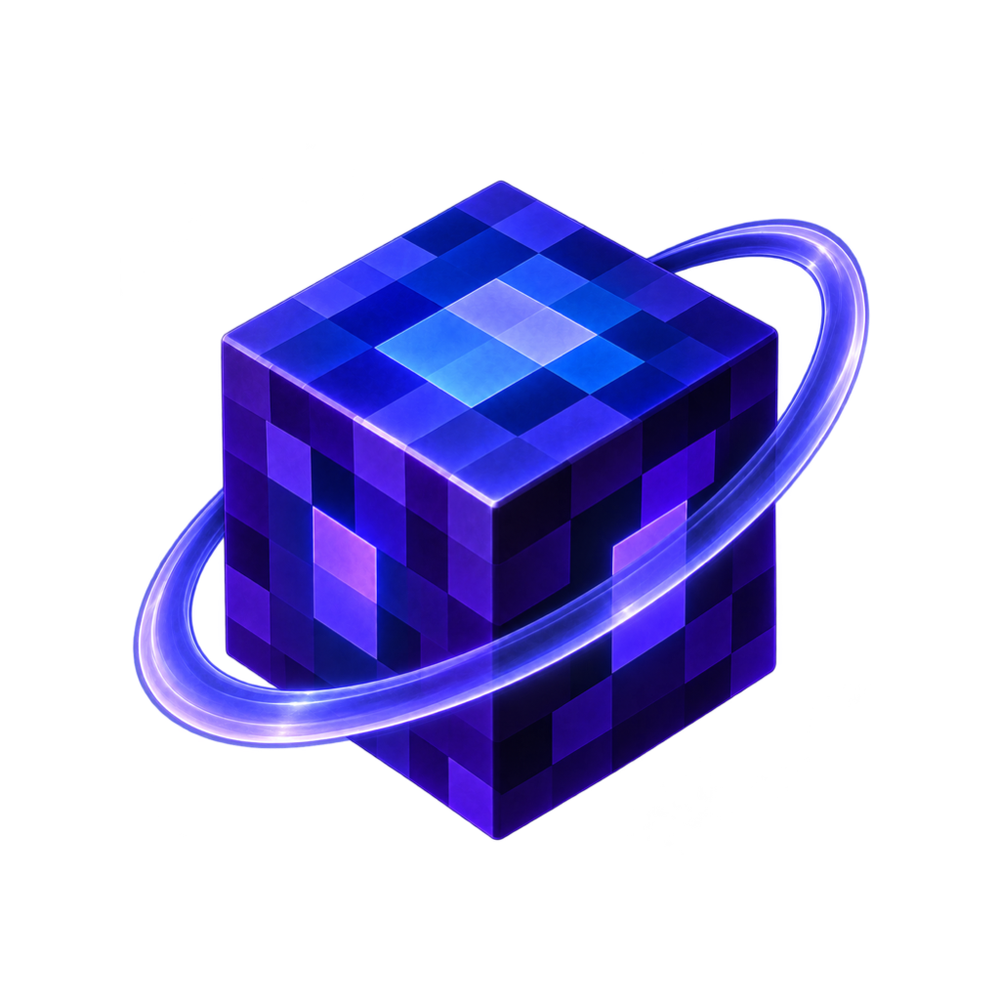
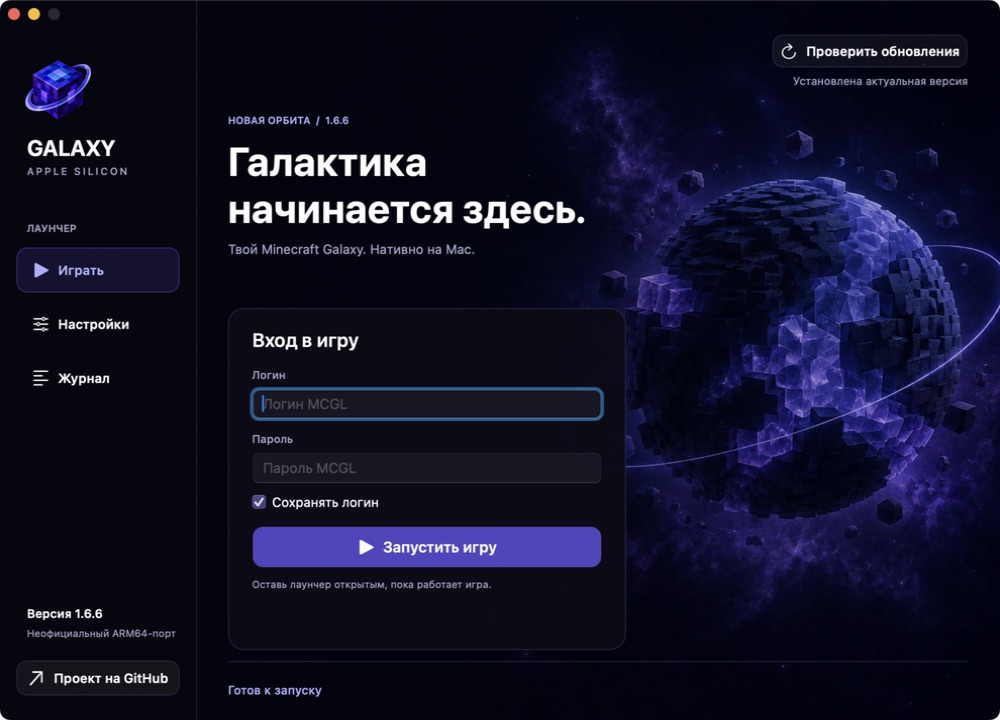
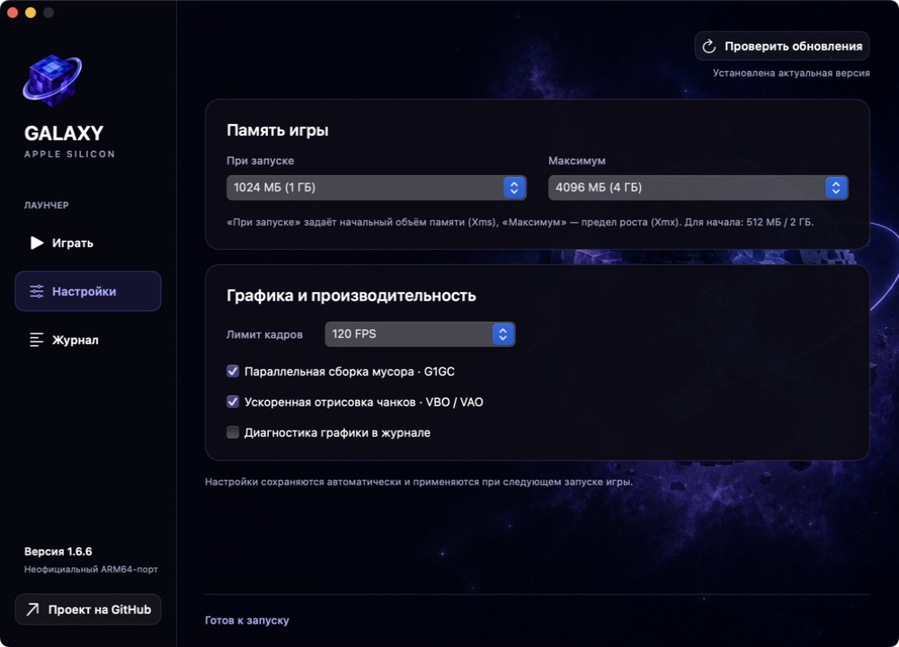
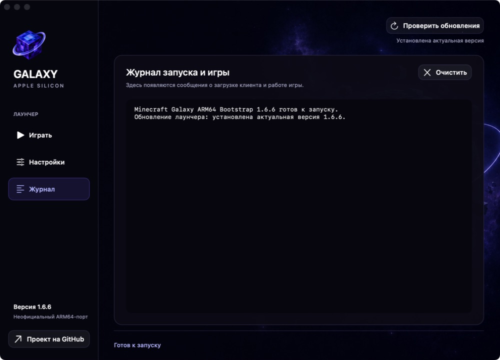

  

<h1 align="center">Minecraft Galaxy ARM64</h1>

  Неофициальный нативный порт для Apple Silicon · версия 1.6.6

  <a href="https://github.com/prilepv/mcgl-arm64/releases/latest"><strong>Скачать последнюю версию</strong></a>
  ·
  <a href="docs/RELEASE-NOTES-1.6.6.md">Что изменилось</a>
  ·
  <a href="https://github.com/prilepv/mcgl-arm64/issues">Сообщить о проблеме</a>

Неофициальный порт Minecraft Galaxy для Mac с Apple Silicon. Я сделал его,
чтобы запускать старый клиент MCGL на ARM64 без Rosetta, и выкладываю исходники
лаунчера, компонентов совместимости и оптимизаций, чтобы их можно было изучить.

## Новая орбита · 1.6.6

Тёмная сине-фиолетовая космическая тема, новая иконка с кубом и орбитой, боковая навигация
и более удобные страницы «Играть», «Настройки» и «Журнал».
Фон статический, без фоновой анимации. Игровые патчи и оптимизации из 1.6.5
сохранены — этот релиз посвящён интерфейсу, а не новым обещаниям FPS.
Запуск и остановка объединены в одну кнопку на странице «Играть».

**Обновление оформления от 6 сентября:** в том же релизе 1.6.6 появилась иконка
с белой скруглённой подложкой. Она собирается средствами macOS из прежнего
куба с орбитой; внутри бокового меню остаётся отдельный прозрачный символ.
Игровой код не менялся. Если 1.6.6 уже установлена, новый DMG
нужно скачать вручную: проверка обновлений не предлагает ту же версию повторно.

Настройки памяти и производительности

Журнал запуска

## Для запуска

- Mac с Apple Silicon (M1 и новее), macOS 14 или новее.
- Интернет для загрузки официальных файлов клиента и учётная запись MCGL.
- Отдельно устанавливать Java, Homebrew или Rosetta не нужно: ARM64 Java 8
  находится внутри приложения.

Скачайте DMG из Releases, откройте его и перенесите **Minecraft Galaxy ARM64**
в **Программы**. Запустите приложение оттуда. При первом запуске лаунчер скачает
файлы с зеркал MCGL и применит патчи порта. Начальная загрузка — примерно 232 МБ.

**Важно про macOS:** у сборки ad-hoc подпись, нет Developer ID и нотариализации
Apple. Поэтому скачивание с GitHub и упаковка в DMG сами по себе не убирают
предупреждения и блокировки macOS. Если доверяете источнику, используйте
штатное разрешение для конкретного приложения в настройках безопасности,
когда macOS предлагает такую возможность. Не отключайте защиту системы целиком.
Если разрешение не помогает, пришлите точный текст ошибки; переустановка Java
не решает блокировку Gatekeeper.
[Инструкция Apple](https://support.apple.com/102445).

## Как работают обновления

В проекте есть два независимых вида обновлений:

1. **Официальные файлы MCGL.** При запуске лаунчер сверяется с официальными
   зеркалами, загружает изменившиеся файлы клиента и затем применяет к ним
   ARM64-патчи этой сборки.
2. **Сам ARM64-лаунчер.** Начиная с 1.6.5 он проверяет раздел
   [GitHub Releases](https://github.com/prilepv/mcgl-arm64/releases/latest).
   Если опубликована более новая версия, лаунчер предложит скачать проверенный
   DMG в «Загрузки» и откроет его. Установка остаётся ручной: запущенное
   приложение никогда не перезаписывает себя незаметно.

Чтобы проверка работала и в будущих версиях, релизы публикуются с тегом
`vX.Y.Z`, а установочный образ называется
`Minecraft-Galaxy-ARM64-Bootstrap-X.Y.Z.dmg`. Рядом с ним публикуется файл
SHA-256 для ручной проверки загрузки.

**Уже установлена 1.6.5?** Нажмите «Проверить обновления» → «Скачать DMG».
После загрузки закройте игру и лаунчер, перенесите приложение из открывшегося
образа в «Программы» с заменой и запустите его оттуда. Настройки памяти, лимит
FPS, галочки и сохранённый логин останутся прежними. Профиль игры удалять
не нужно; 1.6.6 не переустанавливает прежние патчи только из-за смены темы.

## Что есть в порте

- Нативный ARM64-лаунчер, встроенная Java 8 и адаптированные библиотеки.
- Обновление официальных файлов с последующим применением совместимых патчей.
- Исправления полноэкранного режима, сворачивания и изменения размера окна.
- Раздельный выбор начальной (Xms) и максимальной (Xmx) памяти Java.
- Сохранение логина по желанию; пароль в настройках лаунчера не сохраняется.
- Ограничение FPS: 60, 120, 144, 165, 180, 240 или без ограничения.
- Оптимизации частиц, анимаций, сортировки геометрии и отдельный VBO-режим.
- Проверка новых версий лаунчера на странице релизов этого репозитория.
- Тёмная сине-фиолетовая тема 1.6.6; переключение страниц ⌘1 / ⌘2 / ⌘3.
- Единая кнопка запуска и остановки с отображением текущего состояния игры.
- Исправление прозрачных блоков из 1.6.5 сохранено.

Цель оптимизаций — убрать лишнюю работу, сохранив изображение и игровую логику.
Прирост FPS зависит от сцены, разрешения, настроек и модели Mac; фиксированных
цифр не обещаю. При несовместимом обновлении официального клиента отдельные
патчи могут потребовать обновления самого порта.

## Что опубликовано

Это исходники порта 1.6.6 и изменённые файлы LWJGL.
Здесь **нет оригинальных Minecraft.jar / mcgl.jar, игровых ресурсов,
пользовательских профилей, паролей или журналов игровых сессий**.
Bootstrap-приложение тоже получает игровые файлы отдельно с зеркал MCGL.

| Папка | Содержимое |
| --- | --- |
| `native-launcher` | Интерфейс, настройки, загрузка и установка клиента |
| `arm64-runtime` | Запуск JVM и работа с главным потоком macOS |
| `awt-patch`, `native-window-patch` | Запуск игры и мост Java/Cocoa |
| `native-replacements` | ARM64-реализации JNI-компонентов совместимости |
| `performance-patch`, `tools/Patch*.java` | Оптимизации и инструменты применения патчей |
| `third-party/lwjgl2-overlay` | Изменённые файлы LWJGL, включая сгенерированный GL11 |
| `tests` | Проверки алгоритмов и преобразования байткода |

**Сборка из чистого клона пока не автоматизирована полностью.** Исторический
скрипт использует заранее подготовленные зависимости. Что нужно для сборки
и что можно проверить отдельно: [BUILDING.md](BUILDING.md).
Результаты локальной проверки снимка: [TESTING.md](docs/TESTING.md).
Публикация исходников не означает, что побайтовая воспроизводимость готового
DMG уже проверена.

## Обратная связь

Если что-то не работает, создайте [Issue](https://github.com/prilepv/mcgl-arm64/issues)
и укажите модель Mac, версию macOS, версию порта и шаги воспроизведения.
Для проблем с FPS полезны настройки, разрешение и описание сцены.
Из журналов перед отправкой убирайте логин, личные пути и другие личные данные.
Не публикуйте пароль или токены.

## Лицензии и ограничения

Собственный код порта — [MIT](LICENSE). Сторонние файлы сохраняют свои лицензии:
[зависимости и происхождение](docs/DEPENDENCIES.md).
Minecraft и Minecraft Galaxy принадлежат соответствующим правообладателям;
этот репозиторий не является официальным клиентом или проектом их разработчиков.

Про особенности старого протокола, загрузки файлов и приватности:
[SECURITY.md](SECURITY.md). Подробная история сборки:
[заметки к 1.6.6](docs/RELEASE-NOTES-1.6.6.md).
