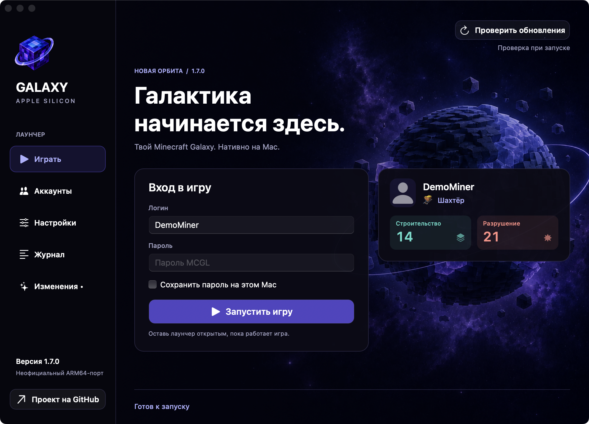
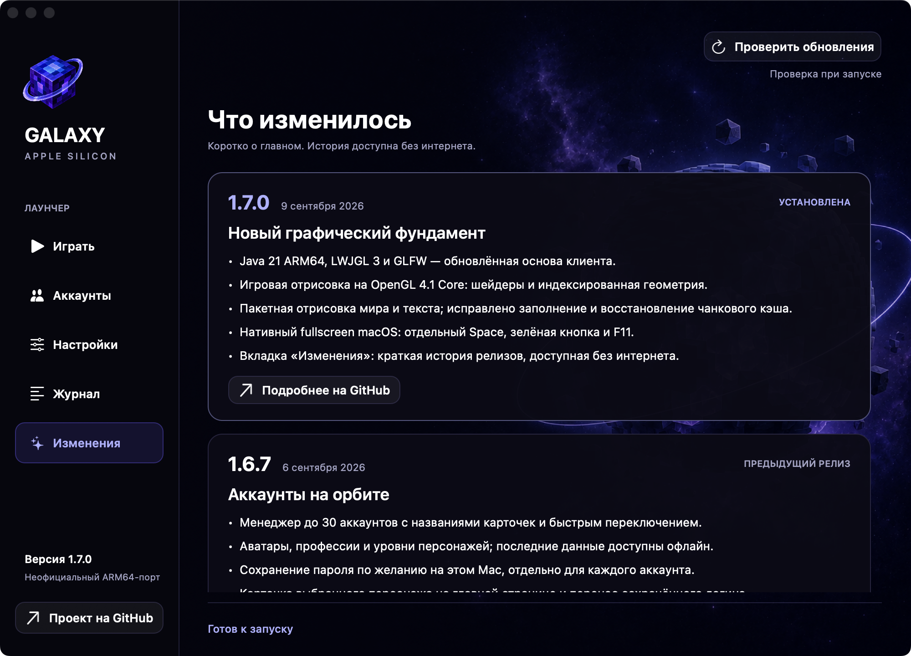
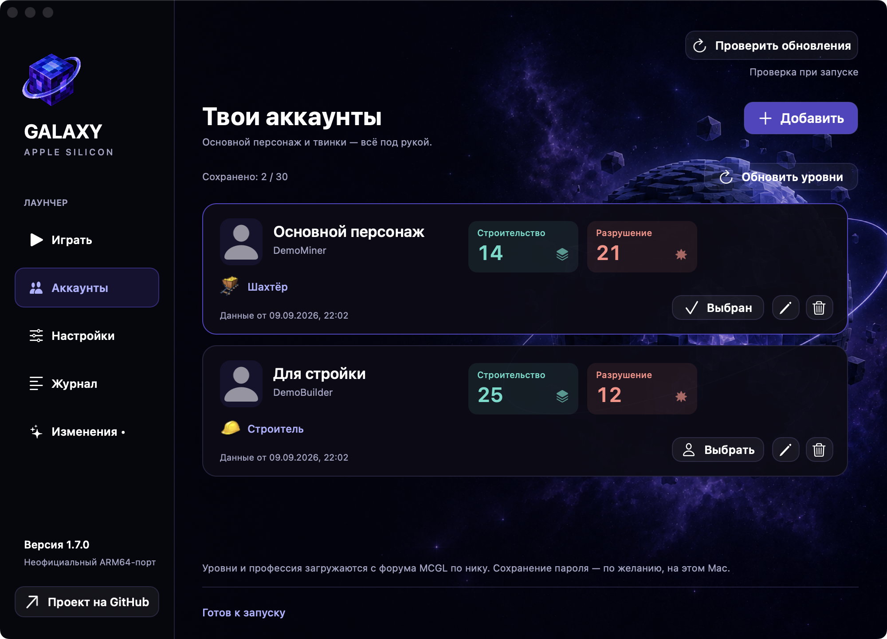
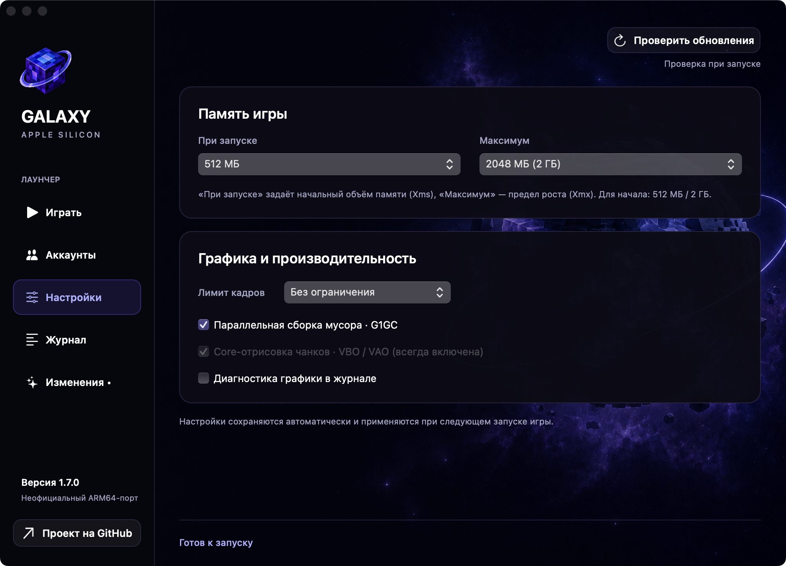
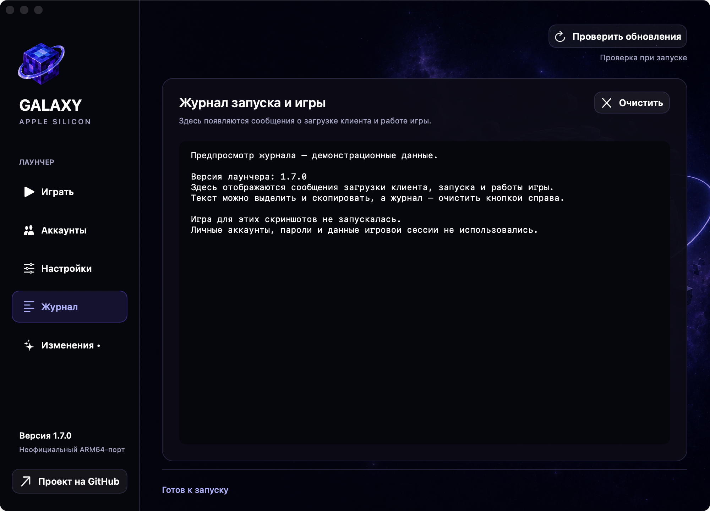

  

<h1 align="center">Minecraft Galaxy ARM64</h1>

  Неофициальный нативный порт для Apple Silicon · 1.7.1
   Java 21 · LWJGL 3 · OpenGL 4.1 Core · macOS Spaces

  <a href="https://github.com/prilepv/mcgl-arm64/releases/latest"><strong>Скачать для Mac</strong></a>
  · <a href="docs/RELEASE-NOTES-1.7.1.md">Что нового</a>
  · <a href="https://github.com/prilepv/mcgl-arm64/issues">Сообщить о проблеме</a>

Minecraft Galaxy на Mac с Apple Silicon, без Rosetta и отдельной установки Java.
В проект входят нативный лаунчер, библиотеки совместимости и игровые патчи.
Это неофициальный порт, не продукт разработчиков Minecraft или Minecraft Galaxy.

## 1.7.1 — исправление осадков

- **Исправлен известный вылет при дожде и снеге:** отрисовка больше не создаёт
  некорректные координаты в столбце осадков непосредственно у камеры.
- **Освещённый текст на табличках рисуется меньшим числом вызовов**,
  с сохранением изображения, порядка символов и освещения.
- **Настройки и аккаунты сохраняются.** Путь отрисовки моделей существ прежний;
  экспериментальное объединение их геометрии в выпуск не включено.

[Подробности исправлений и ограничения](docs/RELEASE-NOTES-1.7.1.md).
Скриншоты ниже показывают интерфейс 1.7.0; в 1.7.1 добавлена новая запись в «Изменениях».

## Основа 1.7.0

- **Обновлённая основа:** встроенная Java 21 ARM64, LWJGL 3 и GLFW для окна и ввода.
- **Игровая отрисовка на OpenGL 4.1 Core:** шейдеры, VAO/VBO и индексированная геометрия.
- **Меньше отдельных вызовов отрисовки:** упорядоченные пакеты мира и текста,
  исправлен расход и восстановление чанкового кэша.
- **Настоящий fullscreen macOS:** отдельный Space, стандартная анимация,
  зелёная кнопка и F11 с восстановлением размера окна.
- **Вкладка «Изменения»:** короткая история 1.7.0 и 1.6.4–1.6.7, доступная
  без интернета. Полные описания открываются отдельно на GitHub.

Исходные выбор и порядок отрисовки чанков, локальная сортировка прозрачности
и игровые настройки сохранены. Прирост FPS зависит от сцены и компьютера:
фиксированных значений или множителей не обещаем. Это проверенный этап
модернизации, а не заявление о полном удалении всего legacy-кода.

Аккаунты, настройки и журнал

Скриншоты — настоящие страницы AppKit с вымышленными DemoMiner/DemoBuilder
и тестовыми уровнями. Личных данных и игровой авторизации в них нет.
[Все изображения](docs/screenshots/1.7.0/README.md).

## Скачать и запустить

Нужны **Mac с Apple Silicon (M1 и новее), macOS 14+**, интернет для загрузки
официальных файлов и аккаунт MCGL. Java 21 уже внутри приложения.

1. Скачайте DMG из [Releases](https://github.com/prilepv/mcgl-arm64/releases/latest).
2. Откройте образ и перенесите **Minecraft Galaxy ARM64** в **Программы**.
3. Запустите лаунчер. При первом запуске он загрузит официальный клиент
   с зеркал MCGL и применит патчи порта. Начальная загрузка — около 232 МБ.

**Подпись ad-hoc; Developer ID и нотариализации Apple нет.** DMG и SHA-256
не отменяют проверки macOS. Если доверяете источнику, используйте штатное
разрешение для конкретного приложения, когда система его предлагает.
Не отключайте защиту macOS целиком. [Инструкция Apple](https://support.apple.com/102445).
При ошибке пришлите её точный текст: переустановка Java не исправляет блокировку Gatekeeper.

## Обновление с 1.6.x и 1.7.0

В лаунчерах с проверкой обновлений нажмите **«Проверить обновления» → «Скачать DMG»**.
После загрузки закройте игру и лаунчер, замените приложение в «Программах»
и запустите 1.7.1. Установка остаётся ручной: приложение не перезаписывает себя.

Аккаунты, настройки, сохранённые пароли и профиль игры находятся вне приложения
и сохраняются. Установщик обновит игровые библиотеки и применит новый набор
патчей; удалять профиль или отдельно ставить Java не нужно.
Публичная и локальные сборки 1.7.0 обнаруживают 1.7.1 как новую версию.

Официальные файлы MCGL обновляются отдельно с зеркал игры. Обновления самого
порта приходят из GitHub Releases с тегом `vX.Y.Z`; рядом с DMG есть SHA-256.
Вкладка «Изменения» содержит отдельные краткие выжимки, а не технические логи.

## Удобства лаунчера

- До 30 аккаунтов, названия карточек, аватары, профессии и уровни персонажей.
- Сохранение пароля по желанию, отдельно для каждого аккаунта.
- Раздельные начальная и максимальная память Java, выбор профиля GC.
- Лимит FPS: 60, 120, 144, 165, 180, 240 или без ограничения.
- Одна кнопка запуска/остановки и журнал для диагностики.
- ⌘1 — Играть, ⌘2 — Аккаунты, ⌘3 — Настройки, ⌘4 — Журнал, ⌘5 — Изменения.

**Сохранение пароля выключено по умолчанию.** Файл зашифрован, но ключ находится
рядом: это удобство, а не защита от программы с доступом к вашим файлам.
Нет Связки ключей или мастер-пароля. Снятие галочки удаляет сохранённую запись.
[Безопасность, старый сетевой протокол и приватность](SECURITY.md).

## Исходники и проверка

Здесь нет оригинальных игровых JAR, игровых ресурсов, пользовательских профилей,
паролей или журналов сессий. Приложение получает клиент с зеркал MCGL.
Семь значков профессий для интерфейса имеют отдельные
[источники и уведомления](native-launcher/Assets/Professions/README.md).

| Каталог | Назначение |
| --- | --- |
| `native-launcher` | AppKit-интерфейс, аккаунты, история релизов, настройки и установщик |
| `arm64-runtime`, `awt-patch` | Запуск Java 21 и игры |
| `platform`, `glfw-compat` | Окно, ввод, macOS JNI-мост и Spaces |
| `renderer`, `lwjgl3-compat` | Core-рендер, шейдеры, геометрия и совместимый API |
| `performance-patch`, `tools` | Патчи оригинального клиента, сборка и проверки |
| `third-party` | Изменённые исходники, лицензии и фиксация зависимостей |
| `tests` | UI, обновление, контракты, байткод и GPU-проверки |

[Сборка](BUILDING.md) · [Проверки](docs/TESTING.md) ·
[Карта модернизации](docs/modernization/README.md) · [Зависимости](docs/DEPENDENCIES.md).

Полная сборка требует заранее подготовленных зависимостей; сборка одной командой
из чистого клона и побайтовая воспроизводимость DMG на другом Mac не заявляются.
Автоматические GPU-тесты и ручная проверка не гарантируют совместимость всех сцен.

## Обратная связь и лицензии

Создайте [Issue](https://github.com/prilepv/mcgl-arm64/issues), указав модель Mac,
macOS, версию порта и шаги воспроизведения. Для FPS добавьте настройки,
разрешение и описание сцены. Перед отправкой удалите из логов личные данные;
не публикуйте пароли и токены.

Собственный код — [MIT](LICENSE), сторонние компоненты сохраняют свои лицензии.
Minecraft и Minecraft Galaxy принадлежат соответствующим правообладателям.

История: [1.7.1](docs/RELEASE-NOTES-1.7.1.md) · [1.7.0](docs/RELEASE-NOTES-1.7.0.md) · [1.6.7](docs/RELEASE-NOTES-1.6.7.md) ·
[1.6.6](docs/RELEASE-NOTES-1.6.6.md) · [1.6.5](docs/RELEASE-NOTES-1.6.5.md) ·
[1.6.4](docs/RELEASE-NOTES-1.6.4.md).
